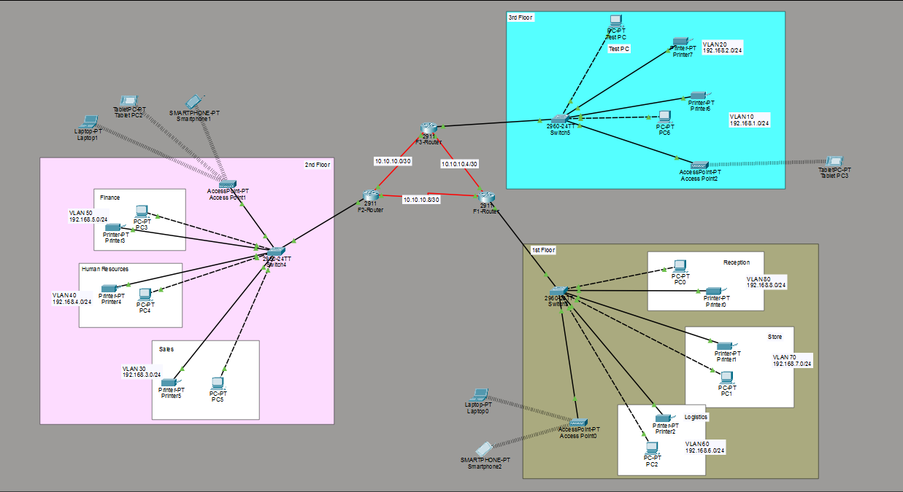

# Hotel Network Design & Implementation (Cisco Packet Tracer)

## Project Overview
This project demonstrates the design and implementation of a secure, scalable, and fully functional multi-floor hotel network using Cisco Packet Tracer. The network supports communication between eight departments across three floors while ensuring traffic segmentation, security, and efficient routing.

##  Network Architecture
- 3 Floors (Each with dedicated router and switch)
- 8 Departments with separate VLANs
- Router-on-a-Stick for Inter-VLAN routing
- OSPF for dynamic routing between floors
- DHCP for automatic IP assignment

## Network Topology

## Departments & VLANs
- Reception → VLAN 80 → 192.168.8.0/24  
- Store → VLAN 70 → 192.168.7.0/24  
- Logistics → VLAN 60 → 192.168.6.0/24  
- Finance → VLAN 50 → 192.168.5.0/24  
- HR → VLAN 40 → 192.168.4.0/24  
- Sales → VLAN 30 → 192.168.3.0/24  
- IT → VLAN 20 → 192.168.2.0/24  
- Administration → VLAN 10 → 192.168.1.0/24  

## Technologies Used
- Cisco Packet Tracer
- VLAN Configuration
- Inter-VLAN Routing (Router-on-a-Stick)
- OSPF Dynamic Routing
- DHCP Server Configuration
- SSH Secure Remote Access
- Port Security (Sticky MAC)
- Wireless LAN (WPA2 Access Points)

##  Security Features
- SSH enabled on all routers for secure remote management
- Port security configured on IT switch (sticky MAC, shutdown mode)
- VLAN segmentation for traffic isolation
- WPA2-secured wireless access points

##  Testing & Results
- DHCP successfully assigned IPs to all devices
- Inter-VLAN and inter-floor communication verified
- OSPF routing tables confirmed full network connectivity
- SSH remote login tested from IT Test-PC
- Port security successfully blocked unauthorized devices
- Wireless devices connected and communicated successfully

##  Project Files
- Cisco Packet Tracer file (.pkt)
- Project report (PDF)
- Network topology screenshot

##  Learning Outcomes
- Enterprise network design using hierarchical architecture
- VLAN and subnet planning
- Dynamic routing with OSPF
- Secure network management using SSH
- Practical implementation of DHCP and WLAN
 
